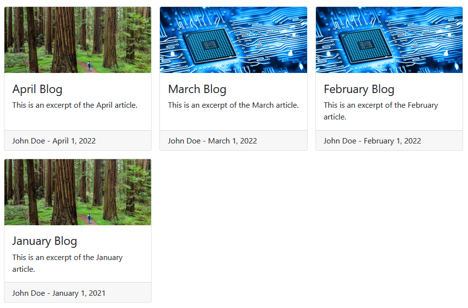

# dash-blog-page
 An easy way to include a blog section in your dash app

## Setup

Install package requirements
```bash
pip install -r requirements.txt
```

Change directory (cd) in to `src` and run the application.
```bash
cd src
python app.py
```

Note: Dash does not require you to cd into the `src` directory to run the app; however, it is required for this setup.
If you have a fix for it, feel free to submit a pull request!

## Blog

Each article is created based on markdown files within the `/src/pages/blog/articles` directory.
For any of the code shown below, please see `/src/pages/blog/layout.py` and `/src/pages/home.py` pages.

### Example article

The below is a sample article, found in `/src/pages/blog/articles/2022-01-01-january-blog.md`.

```md
---
permalink: /blog/january
title: "January Blog"
author: "John Doe"
tab_title: "January Updates"
description: "This is an excerpt of the January article."
image: /assets/blog/woods.png
date: 2022-01-01
---

# Test

Simple write the blog post with Markdown here.
```

The metadata about each article is set using FrontMatter, the variables defined between the `---` components.
Use these variables to set specific information about your application.
When creating each page, we will read the contents of the FrontMatter to set page specific content (such as link, title, description, and image).

### Creating the article

Each article is added to the page registry by iterating over the contents of the article directory.

```python
cwd = os.getcwd()
file_path_in = os.path.join(cwd, 'pages', 'blog', 'articles')
article_files = os.listdir(file_path_in)
for article_name in article_files:
    # read in contents of a given article
    article_path = os.path.join(file_path_in, article_name)
    with open(article_path, 'r', encoding='utf-8') as f:
        post = frontmatter.load(f)

    publish_date = post.get('date')

    # skip articles that aren't published yet or are the sample files
    if publish_date > date.today() or article_name.startswith('sample'):
        continue

    # format image for proper sharing
    sharing_image = post.get('image').lstrip('/assets/')

    # register the specific page for the article
    dash.register_page(
        post.get("title"),
        title=post.get("tab_title"),
        description=post.get("description"),
        image=sharing_image,
        path=post.get("permalink"),
        layout=create_article_page(post)
    )
```

The article is then input into the page layout which defines the title, author, and article contents.

```python
def create_article_page(post):
    '''Create the layout of the article page'''
    date_str = post.get('date').strftime(date_format)

    image = post.get("image")
    layout = html.Div(
        dbc.Row(
            dbc.Col(
                [
                    html.Img(
                        src=f'{image}',
                        className='w-100'
                    ),
                    html.H1(f'{post.get("title")}'),
                    html.Hr(),
                    html.P(f'{post.get("author")} - {date_str}'),
                    html.Hr(),
                    dcc.Markdown(
                        post.content,
                        className='markdown'
                    )
                ],
                lg=10,
                xl=8
            )
        ),
        className='mb-4'
    )
    return layout
```

### Linking to articles

You'll likely want to include links to your article on various other pages.
While iterating over each page, we can also feed the article contents into a card creator.

```python
def create_article_card(post):
    '''Create clickable card to navigate to the article'''
    date_str = post.get('date').strftime(date_format)
    card = dbc.Card(
        html.A(
            [
                dbc.CardImg(src=f'{post.get("image")}', top=True),
                dbc.CardBody(
                    [
                        html.H4(
                            f'{post.get("title")}',
                            className='card-title'
                        ),
                        html.P(
                            f'{post.get("description")}',
                            className='card-text'
                        )
                    ]
                ),
                dbc.CardFooter(
                    f'{post.get("author")} - {date_str}',
                    class_name='mb-0'
                )
            ],
            href=post.get('permalink'),
            className='text-decoration-none text-body h-100 d-flex flex-column align-items-stretch'
        ),
        class_name='article-card h-100'
    )
    return card
```

The resulting cards will be used to populate the blog page, shown below.


